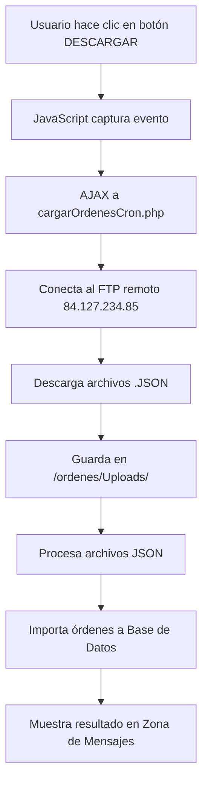

# 📥 Botón DESCARGAR - Documentación

## Identificador
`id="descargar"`

## 🎯 Función Principal
**Descarga archivos JSON del servidor FTP remoto hacia el servidor local**

---

## 🔄 Flujo de Operación



### Paso a Paso

1. **Usuario hace clic** en botón "DESCARGAR FICHEROS del FTP"
2. **JavaScript** (`subirArchivoOrdenes.js`) captura el evento
3. **Petición AJAX** a: `controller/Ordenes/cargarOrdenesCron.php`
4. **Conexión FTP** al servidor remoto (84.127.234.85:21)
5. **Descarga** archivos .JSON desde el FTP de Leader
6. **Almacenamiento** en carpeta local: `/ordenes/Uploads/`
7. **Procesamiento** de los archivos JSON descargados
8. **Importación** de órdenes en la base de datos
9. **Feedback** muestra resultado en la "Zona de Mensajes"

---

## 🎯 Propósito

- **Sincronización**: FTP → Servidor Local → Base de Datos
- **Importación** de órdenes de transporte generadas en el sistema remoto de Leader
- Los archivos JSON contienen:
  - Datos de órdenes
  - Información de clientes
  - Datos de transportistas
  - Detalles de envíos

---

## 📁 Archivos Involucrados

| Tipo | Ruta | Función |
|------|------|---------|
| **Vista** | `view/Transportes/subirOrdenes.php` | Botón HTML |
| **JavaScript** | `subirArchivoOrdenes.js` | Evento click |
| **Controlador** | `controller/Ordenes/cargarOrdenesCron.php` | Lógica FTP + BD |
| **Destino** | `/ordenes/Uploads/` | Archivos descargados |

---

## ⚙️ Configuración FTP

```json
{
  "ipFTP": "84.127.234.85",
  "userFTP": "ftpEfeuno",
  "passFTP": "fTp2o24efeUn0",
  "portFTP": 21
}
```

**Origen**: `config/settings/192.168.31.19.json`

---

## 🔐 Permisos Requeridos

- **Roles permitidos**: 
  - `0` (PROFESOR)
  - `1` (ADMIN)

---

## 📊 Formato de Datos

**Tipo de archivo**: `.JSON`

**Contenido esperado**: 
- Estructura JSON con datos de órdenes de transporte
- Compatible con el modelo de datos de la base de datos `newproject`

---

## 🚨 Manejo de Errores

El resultado de la operación se muestra en:
```html
<div id="zonaMensajes"></div>
```

**Posibles resultados**:
- ✅ Éxito: Archivos descargados e importados
- ⚠️ Advertencia: Algunos archivos con errores
- ❌ Error: Fallo de conexión FTP o BD

---

## 📝 Notas Técnicas

- **Modo FTP**: Pasivo (recomendado)
- **Timeout**: Configurado en el controlador PHP
- **Procesamiento**: Síncrono - el usuario espera la respuesta
- **Log**: Las operaciones se registran en el sistema de logs

---

## 🔗 Ver También

- [Botón SUBIR](#) - Proceso inverso (Local → FTP)
- [Configuración FTP](../../config/settings/192.168.31.19.json)
- [Controlador de Órdenes](../../controller/Ordenes/cargarOrdenesCron.php)
