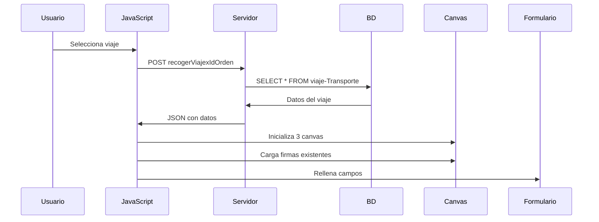
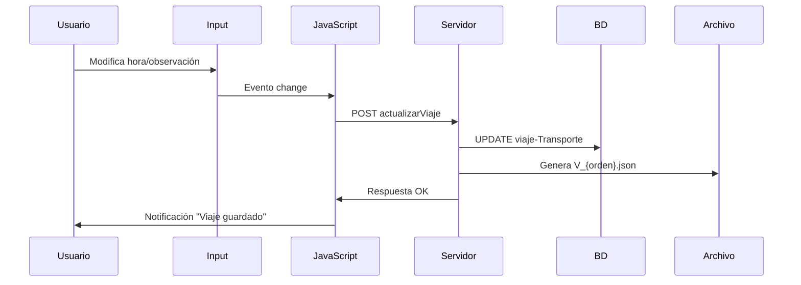
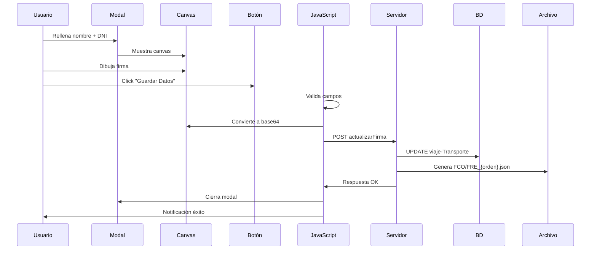

# Documentación: Sistema de Firma y Viajes en Transporte Terrestre

## Índice
1. [Descripción General](#descripción-general)
2. [Flujo de Trabajo](#flujo-de-trabajo)
3. [Estructura de Datos](#estructura-de-datos)
4. [Archivos Involucrados](#archivos-involucrados)
5. [Funciones JavaScript Principales](#funciones-javascript-principales)
6. [Proceso Detallado](#proceso-detallado)
7. [Base de Datos](#base-de-datos)
8. [Archivos JSON Generados](#archivos-json-generados)
9. [Problemas Conocidos](#problemas-conocidos)

---

## Descripción General

El sistema de firma para transportes terrestres permite gestionar los viajes de una orden de transporte, registrando:
- Horarios de llegada y salida
- Observaciones del viaje
- Firmas digitales de conductor, receptor y cliente
- Datos personales de los firmantes

**Pantalla principal:** `view/Transportes/ordenTransporte.php?orden={token}`

---

## Flujo de Trabajo

### 1. Selección del Viaje
1. El usuario accede a la orden de transporte mediante el token
2. En la parte inferior, encuentra un selector desplegable con los viajes asociados a la orden
3. Al seleccionar un viaje, se muestra el formulario con:
   - Hora de llegada
   - Hora de salida
   - Observaciones
   - Botón "Firmar Documento"
   - Botón "Mostrar QR"

### 2. Modificación de Datos del Viaje
- **Guardado automático:** Al cambiar cualquier campo (hora llegada/salida/observaciones), los datos se guardan automáticamente en la base de datos
- **Notificación:** Se muestra "Viaje guardado" tras cada guardado
- **Tabla afectada:** `viaje-Transporte`

### 3. Firma del Documento
1. Click en botón "Firmar Documento"
2. Se abre modal con 3 pestañas:
   - **Firma Conductor**
   - **Firma Receptor** (por defecto activa)
   - **Firma Cliente** (solo visible en órdenes tipo "C")

### 4. Proceso de Firma en el Modal
Para cada tipo de firma:
1. Rellenar campos obligatorios:
   - Nombre
   - DNI/Documento de identidad
2. Al completar estos campos, aparece el canvas de firma
3. Dibujar la firma con ratón/táctil
4. Opcionalmente añadir correo electrónico
5. Click en "Guardar Datos"
6. El sistema:
   - Valida los campos
   - Convierte la firma a imagen base64
   - Guarda en base de datos
   - Genera archivo JSON
   - Cierra el modal
   - Muestra notificación de éxito

---

## Estructura de Datos

### Campos del Viaje (Guardado Automático)
- `fechaLlegadaViaje` - Fecha y hora de llegada
- `fechaSalidaViaje` - Fecha y hora de salida
- `ObservacionViaje` - Observaciones del viaje

### Firma del Conductor
- `FirmaViajeConductor` - Imagen de la firma (base64)
- `nombreViajeConductor` - Nombre del conductor
- `dniViajeConductor` - DNI/Documento del conductor
- **Particularidad:** Si no hay firma guardada, carga automáticamente la firma del perfil del transportista

### Firma del Receptor
- `FirmaViajeReceptor` - Imagen de la firma (base64)
- `nombreViajeReceptor` - Nombre del receptor
- `dniViajeReceptor` - DNI/Documento del receptor
- `correoViajeReceptor` - Correo electrónico del receptor
- **Más usada:** Esta es la firma principal en la mayoría de casos

### Firma del Cliente
- `firmaCliente` - Imagen de la firma (base64)
- `nombreCliente` - Nombre del cliente
- `dniCliente` - DNI/Documento del cliente
- `correoCliente` - Correo electrónico del cliente
- **Ubicación especial:** Se guarda en tabla `orden-Transporte` en lugar de `viaje-Transporte`

---

## Archivos Involucrados

### Vista
- **`view/Transportes/ordenTransporte.php`** - Página principal
- **`view/Transportes/modalQr.php`** - Modal del código QR
- **`view/Transportes/modalFirma.php`** - Modal de firmas (3 pestañas)

### JavaScript
- **`view/Transportes/index.js`** - Lógica principal del sistema de firmas

### Controlador
- **`controller/transportes.php`** - Procesa peticiones AJAX
  - Case `actualizarViaje` - Guarda datos del viaje
  - Case `actualizarFirma` - Guarda firmas (conductor/receptor/cliente)
  - Case `recogerViajexIdOrden` - Carga datos del viaje
  - Case `recogerFirmaPerfil` - Obtiene firma del perfil transportista

### Modelo
- **`models/Transportes.php`** - Interacción con base de datos
  - `actualizarViaje()` - UPDATE en `viaje-Transporte`
  - `actualizarFirma()` - UPDATE en `viaje-Transporte` o `orden-Transporte`
  - `recogerViajexIdOrden()` - SELECT de datos del viaje
  - `recogerFirmaPerfil()` - SELECT firma transportista

---

## Funciones JavaScript Principales

### `$("#selectViajes").change()`
**Ubicación:** `view/Transportes/index.js` línea ~307

**Función:** Detecta cuando se selecciona un viaje del desplegable

```javascript
$("#selectViajes").change(function () {
  var selectedValue = $(this).val();
  if (selectedValue !== "") {
    $(".insertarDatosViaje").removeClass("d-none");
    viajeSeleccionado = selectedValue;
    cargarViaje(selectedValue);
  } else {
    $(".insertarDatosViaje").addClass("d-none");
  }
});
```

### `cargarViaje(idViaje)`
**Ubicación:** `view/Transportes/index.js` línea ~326

**Función:** Carga todos los datos del viaje seleccionado

**Proceso:**
1. Inicializa los 3 canvas de firma (Conductor, Receptor, Cliente)
2. Hace petición AJAX a `recogerViajexIdOrden`
3. Rellena campos del formulario con datos existentes
4. Carga firmas guardadas en los canvas
5. Muestra/oculta canvas según si hay nombre y DNI

### `$(".datosViaje").change()`
**Ubicación:** `view/Transportes/index.js` línea ~617

**Función:** Guardado automático al cambiar datos del viaje

```javascript
$(".datosViaje").change(function () {
  idViaje = $("#selectViajes").val();
  fechaLlegada = $("#fechaLlegada").val();
  fechaSalida = $("#fechaSalida").val();
  observacionesViaje = $("#ObservacionViaje").val();

  $.post(
    "../../controller/transportes.php?op=actualizarViaje",
    {
      idViaje: idViaje,
      fechaLlegada: fechaLlegada,
      fechaSalida: fechaSalida,
      observacionesViaje: observacionesViaje,
    },
    function (data) {
      success_noti_viaje("Viaje guardado");
    }
  );
});
```

### `$("#saveSignatureConductor").click()`
**Ubicación:** `view/Transportes/index.js` línea ~663

**Función:** Guarda firma y datos del conductor

**Proceso:**
1. Valida campos obligatorios
2. Convierte canvas a base64
3. Envía AJAX a `actualizarFirma&autorFirma=conductor`
4. Cierra modal y muestra notificación

### `$("#saveSignatureReceptor").click()`
**Ubicación:** `view/Transportes/index.js` línea ~752

**Función:** Guarda firma y datos del receptor

### `$("#saveSignatureCliente").click()`
**Ubicación:** `view/Transportes/index.js` línea ~708

**Función:** Guarda firma y datos del cliente

---

## Proceso Detallado

### Carga Inicial de Viaje



### Guardado de Datos del Viaje



### Guardado de Firma



---

## Base de Datos

### Tabla: `viaje-Transporte`

**Tabla principal** donde se guarda casi toda la información.

#### Campos del Viaje
| Campo | Tipo | Descripción |
|-------|------|-------------|
| `idViaje` | INT | ID único del viaje (PK) |
| `numeroOrdenViaje` | VARCHAR | Número de la orden asociada |
| `LUGAR_COD` | VARCHAR | Código del lugar |
| `LUGAR_NOMBRE` | VARCHAR | Nombre del lugar |
| `LUGAR_DIRECCION` | VARCHAR | Dirección del lugar |
| `tipoViaje` | VARCHAR | Tipo de viaje (carga/descarga) |
| `fechaLlegadaViaje` | DATETIME | Hora de llegada |
| `fechaSalidaViaje` | DATETIME | Hora de salida |
| `ObservacionViaje` | TEXT | Observaciones del viaje |

#### Campos de Firma Conductor
| Campo | Tipo | Descripción |
|-------|------|-------------|
| `FirmaViajeConductor` | LONGTEXT | Firma en base64 |
| `nombreViajeConductor` | VARCHAR | Nombre del conductor |
| `dniViajeConductor` | VARCHAR | DNI del conductor |

#### Campos de Firma Receptor
| Campo | Tipo | Descripción |
|-------|------|-------------|
| `FirmaViajeReceptor` | LONGTEXT | Firma en base64 |
| `nombreViajeReceptor` | VARCHAR | Nombre del receptor |
| `dniViajeReceptor` | VARCHAR | DNI del receptor |
| `correoViajeReceptor` | VARCHAR | Email del receptor |

### Tabla: `orden-Transporte`

Solo se usa para la **firma del cliente**.

#### Campos de Firma Cliente
| Campo | Tipo | Descripción |
|-------|------|-------------|
| `tokenOrden` | VARCHAR | Token único de la orden (PK) |
| `firmaCliente` | LONGTEXT | Firma en base64 |
| `nombreCliente` | VARCHAR | Nombre del cliente |
| `dniCliente` | VARCHAR | DNI del cliente |
| `correoCliente` | VARCHAR | Email del cliente |

### Tabla: `transportistas-Transporte`

Contiene la firma del perfil del transportista que se usa como firma por defecto del conductor.

| Campo | Descripción |
|-------|-------------|
| `idTransportistaLeader` | DNI del transportista |
| `firmaTransportista_transportistasTransporte` | Firma del perfil |
| `nombreTransportista` | Nombre del transportista |
| `nifTransportista` | NIF del transportista |

---

## Archivos JSON Generados

Todos los archivos se guardan en: **`view/Ordenes/envios/`**

### 1. Archivo de Viaje: `V_{numeroOrden}.json`

**Cuándo se genera:** Al guardar hora de llegada/salida/observaciones

```json
{
    "orden": "337439",
    "lugarCode": "MAD-001",
    "idViaje": "123",
    "viaje": "Madrid - Calle Principal 123",
    "fechaLlegada": "2026-01-27T10:30",
    "fechaSalida": "2026-01-27T12:45",
    "observaciones": "Entrega sin incidencias"
}
```

### 2. Archivo Firma Conductor: `FCO_{numeroOrden}.json`

**Cuándo se genera:** Al guardar firma del conductor

```json
{
    "orden": "337439",
    "lugarCode": "MAD-001",
    "idViaje": "123",
    "firmaConductor": "data:image/png;base64,iVBORw0KGgoAAAANS..."
}
```

### 3. Archivo Firma Receptor: `FRE_{numeroOrden}.json`

**Cuándo se genera:** Al guardar firma del receptor

```json
{
    "orden": "337439",
    "lugarCode": "MAD-001",
    "idViaje": "123",
    "firmaReceptor": "data:image/png;base64,iVBORw0KGgoAAAANS..."
}
```

### 4. Archivo Firma Cliente

**Cuándo se genera:** Al guardar firma del cliente

*(Similar estructura a los anteriores)*

---

## Problemas Conocidos

### 1. Código QR no se muestra

**Problema:** Al abrir el modal del QR, este no se renderiza.

**Causa:** 
- La librería `QRCodeStyling` podría no cargarse desde el CDN
- Variable `qrCode` tenía scope limitado
- Referencia a imagen local `ojo.png` inexistente

**Solución implementada:**
- Variable global `qrCodeInstance`
- Validación de disponibilidad de librería
- Eliminada dependencia de imagen local
- Logs de depuración en consola

**Archivo modificado:** `view/Transportes/index.js` líneas ~176-257

### 2. Dependencia de librería externa

**CDN usado:**
```html
<script src="https://cdn.jsdelivr.net/npm/qr-code-styling@1.6.0-rc.1/lib/qr-code-styling.min.js"></script>
```

**Ubicación:** `view/Transportes/ordenTransporte.php` línea ~1745

**Riesgo:** Si el servidor no tiene acceso a Internet o el CDN falla, el QR no funcionará.

**Recomendación:** Considerar descargar la librería localmente.

### 3. Canvas de firma oculto por defecto

**Comportamiento MEJORADO:** 
- Los canvas de firma están **ocultos por defecto** hasta que se completen los campos obligatorios
- Se muestra un **mensaje informativo** azul: "Complete nombre y documento para activar el área de firma"
- Al rellenar nombre y DNI, el mensaje desaparece y aparece el canvas

**Mejoras implementadas:**
- **Auto-rellenado de datos del conductor:** Los campos de nombre y DNI del conductor se pre-rellenan automáticamente con los datos de la orden (`CONDUCTOR_NOMBRE` y `CONDUCTOR_NIF`)
- **Optimización para móvil:** Campos con atributos `autocomplete` e `inputmode` apropiados
- **Mensajes informativos:** Alertas visuales en las 3 pestañas indicando qué campos son necesarios
- **Funciones reutilizables:** `verificarCamposConductor()`, `verificarCamposReceptor()`, `verificarCamposCliente()`

**Archivos modificados:**
- `view/Transportes/modalFirma.php` - Añadidos mensajes informativos y atributos de optimización móvil
- `view/Transportes/ordenTransporte.php` - Añadidos inputs ocultos con datos del conductor
- `view/Transportes/index.js` - Lógica de pre-rellenado y verificación refactorizada

**Código de pre-rellenado:**
```javascript
// Pre-rellenar datos del conductor desde el formulario
var conductorNombre = $("#conductorNombreData").val();
var conductorNif = $("#conductorNifData").val();

if (conductorNombre && conductorNombre.trim() !== '') {
  $("#nombreInputConductor").val(conductorNombre);
}

if (conductorNif && conductorNif.trim() !== '') {
  $("#DNIinputConductor").val(conductorNif);
}
```

**Optimizaciones para móvil:**
- `autocomplete="name"` - Facilita autocompletado del nombre
- `autocomplete="email"` - Facilita autocompletado del correo
- `autocomplete="off"` - Desactiva autocompletado en DNI (datos sensibles)
- `inputmode="text"` - Optimiza teclado virtual
- `inputmode="email"` - Muestra teclado con @ para emails
- `type="email"` - Validación HTML5 de emails

---

## Resumen de Flujo Completo

1. **Usuario accede** a la orden de transporte
2. **Selecciona viaje** del desplegable
3. **Sistema carga** datos existentes automáticamente
4. **Usuario modifica** hora llegada/salida/observaciones → **Guardado automático**
5. **Usuario hace click** en "Firmar Documento" → Abre modal
6. **Usuario selecciona** pestaña (Conductor/Receptor/Cliente)
7. **Usuario rellena** nombre y DNI → Aparece canvas
8. **Usuario firma** en el canvas
9. **Usuario hace click** "Guardar Datos"
10. **Sistema valida** campos
11. **Sistema guarda** en base de datos
12. **Sistema genera** archivo JSON
13. **Sistema cierra** modal y notifica éxito

---

## Notas Técnicas

### Canvas de Firma

**Librería usada:** `jquery.signaturepad.js`

**Configuración:**
```javascript
$("#fsignatureContainerConductor").find("form").signaturePad({
  drawOnly: true,
  defaultAction: "drawIt",
  validateFields: false,
  lineWidth: 0,
  clear: "input[type=reset]",
  drawBezierCurves: true,
  lineTop: 200,
});
```

### Conversión a Imagen

```javascript
signatureDataConductor = signaturePadConductor.toDataURL("image/png");
```

La firma se convierte a formato **base64 PNG** antes de enviarse al servidor.

### Validación de Campos

La función `validarCamposVacios()` se encarga de verificar que todos los campos obligatorios estén correctamente rellenados antes de permitir el guardado.

---

## Mejoras Propuestas

### Corto Plazo
- [ ] Verificar carga de librería QRCodeStyling en servidor remoto
- [ ] Añadir más logs de depuración para tracking de errores
- [ ] Validar que las firmas se guarden correctamente en todos los escenarios

### Medio Plazo
- [ ] Descargar librería QRCodeStyling localmente para evitar dependencia de CDN
- [ ] Implementar sistema de respaldo si falla la generación de JSON
- [ ] Añadir confirmación antes de sobrescribir firmas existentes
- [ ] Mejorar UX: loading spinners durante guardado

### Largo Plazo
- [ ] Migrar a sistema de firmas con certificado digital
- [ ] Implementar sistema de auditoría de firmas
- [ ] Añadir timestamps verificables en cada firma
- [ ] Permitir múltiples firmas por viaje (varios receptores)

---

*Documento creado: 27 de enero de 2026*  
*Última actualización: 27 de enero de 2026 - 18:45*  
*Versión: 1.1 - Añadidas mejoras de UX para móvil y pre-rellenado automático*
