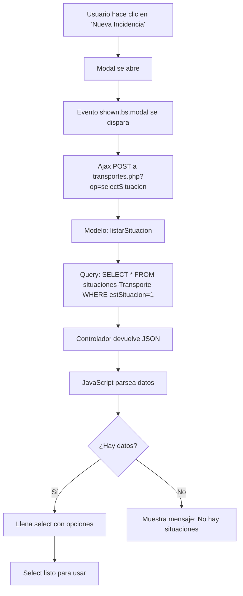

# Registro de Modificaciones - Sistema Logística Leader

## Información del Documento
- **Fecha de creación:** 27 de enero de 2026
- **Última actualización:** 27 de enero de 2026
- **Rama:** terrestre
- **Propósito:** Documentar todas las modificaciones realizadas en el sistema

---

## Índice de Modificaciones

1. [Mejoras en Sistema de Firmas y QR](#modificación-1-mejoras-en-sistema-de-firmas-y-qr)
2. [Optimización de Canvas de Firma](#modificación-2-optimización-de-canvas-de-firma)
3. [Corrección Configuración SMTP para Envío de Correos](#modificación-3-corrección-configuración-smtp-para-envío-de-correos)
4. [Corrección de Carga de Situaciones en Modal de Incidencias](#modificación-4-corrección-de-carga-de-situaciones-en-modal-de-incidencias)
5. [Configuración SMTP Temporal Hardcodeada](#modificación-5-configuración-smtp-temporal-hardcodeada) ⚠️
6. [Mejora en Manejo de Errores de PHPMailer](#modificación-6-mejora-en-manejo-de-errores-de-phpmailer)
7. [Corrección de Path para Enlaces de Email](#modificación-7-corrección-de-path-para-enlaces-de-email)
8. [Actualización de .gitignore](#modificación-8-actualización-de-gitignore)
9. [Documentación de Formatos de Impresión](#modificación-9-documentación-de-formatos-de-impresión)
10. [Sistema de Monitor de Sesión Automático](#modificación-10-sistema-de-monitor-de-sesión-automático)
11. [Reorganización de Documentación](#modificación-11-reorganización-de-documentación)

---

## Modificación #1: Mejoras en Sistema de Firmas y QR

**Fecha:** 27 de enero de 2026  
**Pantalla afectada:** `view/Transportes/ordenTransporte.php`  
**Tipo:** Mejora - UX / Corrección de Errores

### Descripción del Problema
- El código QR no se mostraba al abrir el modal
- Los campos de firma no eran intuitivos (canvas oculto sin explicación)
- Faltaba optimización para dispositivos móviles
- Los datos del conductor no se pre-rellenaban automáticamente

### Cambios Realizados

#### 1. Corrección del Código QR
**Archivos modificados:**
- `view/Transportes/index.js`

**Cambios:**
- Creada variable global `qrCodeInstance` para evitar problemas de scope
- Añadida validación de disponibilidad de librería `QRCodeStyling`
- Eliminada dependencia de imagen local `ojo.png`
- Añadidos logs de depuración en consola

**Código relevante:**
```javascript
// Variable global para el QR
var qrCodeInstance = null;

if (typeof QRCodeStyling !== 'undefined') {
  try {
    qrCodeInstance = new QRCodeStyling({...});
    console.log("QRCodeStyling inicializado correctamente");
  } catch (error) {
    console.error("Error al inicializar QRCodeStyling:", error);
  }
}
```

#### 2. Mensajes Informativos en Modal de Firma
**Archivos modificados:**
- `view/Transportes/modalFirma.php`

**Cambios:**
- Añadidos mensajes informativos en las 3 pestañas del modal
- Mensaje: "Complete nombre y documento para activar el área de firma"
- Los mensajes desaparecen automáticamente al completar los campos

**Código añadido:**
```html
<div id="mensajeInfoConductor" class="col-12 alert alert-info text-center mg-b-20" role="alert">
    <i class="bx bx-info-circle"></i> Complete nombre y documento para activar el área de firma
</div>
```

#### 3. Pre-rellenado Automático de Datos del Conductor
**Archivos modificados:**
- `view/Transportes/ordenTransporte.php`
- `view/Transportes/index.js`

**Cambios:**
- Añadidos inputs ocultos con datos del conductor:
  - `conductorNombreData`: Contiene `CONDUCTOR_NOMBRE`
  - `conductorNifData`: Contiene `CONDUCTOR_NIF`
- JavaScript pre-rellena automáticamente los campos al abrir el modal
- Funciona tanto al cargar la página como al abrir el modal

**Código PHP añadido:**
```php
<input id="conductorNombreData" type="hidden" value="<?php echo isset($jsonDatos['CONDUCTOR_NOMBRE']) ? $jsonDatos['CONDUCTOR_NOMBRE'] : ''; ?>">
<input id="conductorNifData" type="hidden" value="<?php echo isset($jsonDatos['CONDUCTOR_NIF']) ? $jsonDatos['CONDUCTOR_NIF'] : ''; ?>">
```

**Código JavaScript añadido:**
```javascript
$('#firma_modal').on('shown.bs.modal', function () {
  preRellenarConductor();
});
```

#### 4. Optimización para Móvil
**Archivos modificados:**
- `view/Transportes/modalFirma.php`

**Cambios:**
- Añadido `autocomplete="name"` en campos de nombre
- Añadido `autocomplete="email"` en campos de correo
- Añadido `autocomplete="off"` en campos de DNI (seguridad)
- Añadido `inputmode="text"` para campos de texto
- Añadido `inputmode="email"` para campos de email
- Cambiado `type="text"` a `type="email"` en campos de correo

#### 5. Refactorización de Código
**Archivos modificados:**
- `view/Transportes/index.js`

**Cambios:**
- Creadas funciones reutilizables:
  - `verificarCamposConductor()`
  - `verificarCamposReceptor()`
  - `verificarCamposCliente()`
- Eliminado código duplicado en función `cargarViaje()`

### Archivos Modificados (Resumen)
```
✓ view/Transportes/modalFirma.php
✓ view/Transportes/ordenTransporte.php
✓ view/Transportes/index.js
✓ docs/firma-transporte.md (documentación actualizada)
```

### Testing Realizado
- [ ] Verificar QR en servidor remoto
- [ ] Probar pre-rellenado de campos conductor
- [ ] Verificar mensajes informativos
- [ ] Probar en dispositivos móviles

---

## Modificación #2: Optimización de Canvas de Firma

**Fecha:** 27 de enero de 2026  
**Pantalla afectada:** `view/Transportes/ordenTransporte.php` - Modal de Firma  
**Tipo:** Mejora - UX / Usabilidad Móvil

### Descripción del Problema
Los canvas de firma tenían un tamaño horizontal limitado (400px), lo que dificultaba firmar cómodamente, especialmente en dispositivos móviles en orientación horizontal.

### Cambios Realizados

#### Aumento del Tamaño Horizontal de Canvas
**Archivos modificados:**
- `view/Transportes/modalFirma.php`
- `view/Transportes/index.js`

**Cambios:**
- Aumentado el ancho de todos los canvas de **400px a 600px**
- Afecta a: Canvas Conductor, Canvas Receptor, Canvas Cliente
- Mantiene altura de 300px
- Actualizado tanto en HTML como en funciones JavaScript de redimensionamiento

**Antes:**
```html
<canvas id="signaturePadConductor" width="400" height="300"></canvas>
```

**Después:**
```html
<canvas id="signaturePadConductor" width="600" height="300"></canvas>
```

**JavaScript actualizado:**
```javascript
const onResize = () => {
  $("#signaturePadConductor").attr({
    height: 200,
    width: 600, // Aumentado para mejor experiencia en móvil
  });
};
```

### Archivos Modificados (Resumen)
```
✓ view/Transportes/modalFirma.php (3 canvas actualizados)
✓ view/Transportes/index.js (3 funciones onResize actualizadas)
```

### Beneficios
- Mayor espacio para firmar en dispositivos móviles
- Mejor experiencia de usuario en tablets
- Firmas más naturales y legibles

---

## Modificaciones Pendientes

## Modificación #3: Corrección Configuración SMTP para Envío de Correos

**Fecha:** 27 de enero de 2026  
**Componente afectado:** Sistema de envío de correos electrónicos  
**Tipo:** Corrección de Error - Configuración + Scripts de Depuración

### Descripción del Problema
Al intentar enviar correos electrónicos desde el sistema (ej: enviar orden al receptor), se producía el siguiente error:
```
SMTP Error: The following recipients failed: correo@dominio.es: Relay access denied
```

**Causas detectadas:**
1. Falta configuración de cifrado SSL/TLS en `configMail.php`
2. Uso de constantes PHPMailer no disponibles en archivo de configuración incluido
3. Necesidad de verificar credenciales SMTP en base de datos

### Cambios Realizados

#### 1. Configuración SSL/TLS Corregida
**Archivos modificados:**
- `controller/configMail.php`

**Primera versión (con error):**
Intentaba usar constantes de PHPMailer que no estaban disponibles porque el archivo se incluye sin cargar la clase:
```php
// ERROR: PHPMailer::ENCRYPTION_STARTTLS no disponible
if ($smtp_port == 587) {
   $mail->SMTPSecure = PHPMailer::ENCRYPTION_STARTTLS;
}
```

**Versión corregida (funcional):**
Usa literales de string compatibles con PHPMailer incluido vía `require`:
```php
// Configuración de cifrado según el puerto
if ($smtp_port == 587) {
   $mail->SMTPSecure = 'tls';      // TLS para puerto 587 (STARTTLS)
} elseif ($smtp_port == 465) {
   $mail->SMTPSecure = 'ssl';      // SSL para puerto 465 (SMTPS)
}
// Puerto 25 no configura cifrado
```

**Código completo añadido:**
```php
<?php
// Configuración SMTP
if ($smtp_auth == 1) {
   $mail->SMTPAuth   = true;
} else {
   $mail->SMTPAuth   = false;
}

$mail->Host       = $smtp_host;
$mail->Username   = $smtp_username;
$mail->Password   = $smtp_pass;
$mail->Port       = $smtp_port;

// Configuración de cifrado según el puerto
if ($smtp_port == 587) {
   $mail->SMTPSecure = 'tls';      // TLS para puerto 587 (STARTTLS)
} elseif ($smtp_port == 465) {
   $mail->SMTPSecure = 'ssl';      // SSL para puerto 465 (SMTPS)
}
// Puerto 25 no configura cifrado (no recomendado para producción)
?>
```

#### 2. Script de Depuración Simple (Recomendado)
**Archivo creado:** `debug_smtp_simple.php` (raíz del proyecto)

**Características:**
- Conexión directa a BD sin dependencias de sesiones
- Lee configuración del archivo JSON del dominio
- Consulta la vista `view_empresa_config` (JOIN entre `empresa` y `tm_config`)
- Muestra configuración SMTP actual de forma segura
- Oculta parcialmente la contraseña
- Diagnóstico automático según puerto configurado
- Verifica extensiones PHP necesarias (openssl, sockets)
- Proporciona checklist para el cliente

**Uso:**
1. Subir archivo a raíz: `https://tudominio.com/logistica/debug_smtp_simple.php`
2. Acceder desde navegador
3. Copiar información mostrada
4. Enviar al cliente para validación de credenciales
5. **ELIMINAR archivo inmediatamente** después de usar (seguridad)

**Información que muestra:**
- ✓ Servidor SMTP (host)
- ✓ Puerto configurado
- ✓ Usuario SMTP
- ✓ Contraseña (parcialmente oculta: `ab******yz`)
- ✓ Autenticación activada/desactivada
- ✓ Cifrado recomendado según puerto
- ✓ IP del servidor web (para whitelist)
- ✓ Versión de PHP
- ✓ Extensiones PHP disponibles

#### 3. Script de Depuración con Sesión (Alternativo)
**Archivo creado:** `debug_smtp.php` (raíz del proyecto)

**Características:**
- Usa sesión y clase Config (igual que la aplicación)
- Requiere estar logueado
- Misma información que el script simple
- Puede dar error 500 si hay problemas de carga de clases

**Recomendación:** Usar `debug_smtp_simple.php` que es más robusto

### Verificación de PHPMailer

**Ubicación:** `public/vendor/phpmailer/phpmailer/`

**Carga:**
```php
// En controller/transportes.php línea 8
require_once '../public/vendor/autoload.php';

// Uso con namespace
use PHPMailer\PHPMailer\PHPMailer;
$mail = new PHPMailer(true);
```

✓ **PHPMailer está correctamente instalado y cargado**

✓ **PHPMailer está correctamente instalado y cargado**

### Funcionalidad del Sistema de Correo

#### Ubicación del Botón de Envío
**Pantalla:** `view/Transportes/ordenTransporte.php`  
**Modal:** "Firmar Documento" → Pestaña "Firma Receptor"  
**Botón:** Icono rojo de sobre 📧 (botón `#enviarCorreoReceptorBtn`)

#### Proceso de Envío
1. Usuario completa datos del receptor:
   - Nombre
   - DNI/Documento
   - **Correo electrónico** (obligatorio para envío)
2. Click en botón rojo del sobre (NO en "Guardar Datos")
3. JavaScript valida formato de email
4. AJAX llama a `controller/transportes.php` caso `correoEnviarOrden`
5. PHP crea instancia PHPMailer y carga configuración SMTP
6. Se incluye `controller/configMail.php` (donde ahora está el cifrado)
7. Carga plantilla HTML: `public/mailTemplate/envioClienteOrden.html`
8. Reemplaza variables: `{{numeroOrden}}`, `{{enlaceOrden}}`
9. Envía correo usando SMTP configurado
10. Retorna JSON con éxito/error

#### Contenido del Email
**Asunto:** "Orden de Transporte - Leader Transport"

**Cuerpo HTML:**
- Encabezado con logo de Leader Transport
- Mensaje: "Has recibido una nueva orden de transporte"
- Número de orden destacado
- Botón verde: "Imprimir esta orden" → Enlace directo al PDF
- Footer con información de contacto

**Plantilla:** `public/mailTemplate/envioClienteOrden.html`

#### Código JavaScript del Envío
Ubicación: `view/Transportes/index.js` líneas ~1725-1793

```javascript
function enviarCorreoDatos() {
  var emailReceptor = $('#emailReceptor').val();
  var orden = getUrlParameter('orden');
  
  // Validación de email
  var emailRegex = /^[^\s@]+@[^\s@]+\.[^\s@]+$/;
  if (!emailRegex.test(emailReceptor)) {
    swal("Advertencia!", "Ingrese un correo electrónico válido", "warning");
    return;
  }

  $.post("../../controller/transportes.php?op=correoEnviarOrden", {
    email: emailReceptor,
    orden: orden
  }, function(data) {
    // Manejo de respuesta
  });
}
```

### Datos a Proporcionar al Cliente

### Datos a Proporcionar al Cliente

Ejecutar `debug_smtp_simple.php` y enviar al cliente la siguiente información:

**Configuración Actual en BD:**
- [ ] **Servidor SMTP:** _______________
- [ ] **Puerto:** _______________
- [ ] **Usuario SMTP:** _______________
- [ ] **Contraseña:** (verificar longitud y primeros/últimos caracteres)
- [ ] **Autenticación:** Activada ☐ / Desactivada ☐
- [ ] **Cifrado aplicado:** TLS (puerto 587) ☐ / SSL (puerto 465) ☐
- [ ] **IP del servidor web:** _______________ (para whitelist si es necesario)

**Preguntas para el Cliente:**

1. **Credenciales**
   - ☐ ¿El servidor SMTP es correcto?
   - ☐ ¿El puerto es el adecuado? (587 es el más común)
   - ☐ ¿Usuario y contraseña son correctos y están activos?

2. **Configuración del Servidor SMTP**
   - ☐ ¿El servidor requiere autenticación? (normalmente sí)
   - ☐ ¿El servidor requiere cifrado TLS/SSL? (normalmente sí)
   - ☐ ¿Qué tipo de cifrado: TLS (587) o SSL (465)?

3. **Restricciones y Permisos**
   - ☐ ¿El servidor permite relay desde la IP mostrada?
   - ☐ ¿Es necesario añadir la IP a una lista blanca (whitelist)?
   - ☐ ¿Hay límite de correos por hora/día/mes?
   - ☐ ¿Hay algún firewall o restricción en el hosting?

4. **Pruebas Alternativas**
   - ☐ ¿Funciona el SMTP desde otro cliente (Outlook, Thunderbird)?
   - ☐ ¿El proveedor SMTP proporciona logs de intentos de conexión?

### Protocolo de Testing

#### Fase 1: Verificación de Configuración
1. ✓ Subir `controller/configMail.php` actualizado al servidor
2. ✓ Subir `debug_smtp_simple.php` a la raíz
3. ☐ Acceder a `https://leader-transport.com/logistica/debug_smtp_simple.php`
4. ☐ Capturar pantalla con la configuración mostrada
5. ☐ Enviar al cliente para validación de credenciales
6. ☐ Esperar confirmación del cliente

#### Fase 2: Prueba de Envío Real
1. ☐ Acceder a una orden: `Transportes/ordenTransporte.php?orden=XXXXX`
2. ☐ Seleccionar un viaje del selector
3. ☐ Click en botón "Firmar Documento"
4. ☐ Ir a pestaña "Firma Receptor"
5. ☐ Completar:
   - Nombre: `Test Receptor`
   - DNI: `12345678A`
   - Email: `correo-prueba@dominio.com` (usar email real de prueba)
6. ☐ Click en botón rojo del sobre 📧
7. ☐ Verificar notificación de éxito/error en pantalla
8. ☐ Revisar bandeja de entrada del correo de prueba
9. ☐ Verificar que el email contiene:
   - Asunto correcto
   - Número de orden correcto
   - Botón de "Imprimir esta orden" funcional

#### Fase 3: Depuración Avanzada (si falla)
1. ☐ Habilitar debug en `configMail.php`:
   ```php
   $mail->SMTPDebug = 2;
   $mail->Debugoutput = 'html';
   ```
2. ☐ Repetir envío y capturar logs completos
3. ☐ Revisar logs del servidor SMTP (solicitar al cliente)
4. ☐ Probar conexión manual al SMTP:
   ```bash
   # Para TLS (puerto 587)
   telnet smtp.servidor.com 587
   
   # Para SSL (puerto 465)
   openssl s_client -connect smtp.servidor.com:465
   ```

#### Fase 4: Limpieza
1. ☐ **ELIMINAR** `debug_smtp_simple.php` del servidor
2. ☐ **ELIMINAR** `debug_smtp.php` si existe
3. ☐ Deshabilitar `SMTPDebug` en `configMail.php` si se activó
4. ☐ Documentar resultado final en este documento

4. ☐ Documentar resultado final en este documento

### Causas Comunes del Error "Relay Access Denied"

| # | Causa | Solución | Estado |
|---|-------|----------|--------|
| 1 | **Falta cifrado SSL/TLS** | Añadir `SMTPSecure = 'tls'` o `'ssl'` | ✓ Solucionado |
| 2 | **Credenciales incorrectas** | Verificar usuario/contraseña con cliente | ☐ Pendiente verificación |
| 3 | **IP no autorizada** | Cliente debe añadir IP a whitelist del SMTP | ☐ Pendiente verificación |
| 4 | **Puerto incorrecto** | Confirmar: 587 (TLS) o 465 (SSL) | ☐ Pendiente verificación |
| 5 | **Autenticación desactivada** | Activar `SMTPAuth = true` | ✓ Ya configurado |
| 6 | **Límites excedidos** | Esperar o solicitar aumento de límite | ☐ N/A |
| 7 | **Firewall bloqueando** | Abrir puerto en firewall del servidor | ☐ Pendiente verificación |
| 8 | **Constantes PHPMailer no disponibles** | Usar strings 'tls'/'ssl' en lugar de constantes | ✓ Solucionado |

### Archivos Modificados (Resumen)

```
✓ controller/configMail.php         (configuración SSL/TLS con strings)
✓ debug_smtp_simple.php             (script diagnóstico - TEMPORAL)
✓ debug_smtp.php                    (script alternativo - TEMPORAL)
✓ docs/modificaciones.md            (este documento actualizado)
```

### Archivos Temporales a ELIMINAR Después de Testing

⚠️ **IMPORTANTE - SEGURIDAD:**
```
❌ debug_smtp_simple.php    → Contiene información sensible de configuración
❌ debug_smtp.php            → Contiene información sensible de configuración
```

**Razón:** Estos scripts muestran configuración SMTP (servidor, usuario, contraseña parcial) que no debe ser accesible públicamente.

### Estado de la Base de Datos

**Tabla:** `tm_config`  
**Vista:** `view_empresa_config` (JOIN entre `empresa` y `tm_config`)

**Campos SMTP:**
- `smtp_host` - Servidor SMTP (ej: smtp.ionos.es)
- `snto_auth` - Autenticación: 1=activada, 0=desactivada
- `smtp_username` - Usuario de autenticación
- `smtp_pass` - Contraseña (almacenada en texto plano)
- `smtp_port` - Puerto: 587 (TLS), 465 (SSL), 25 (sin cifrado)
- `smtp_receptor` - Email del remitente por defecto

**Consulta para verificar:**
```sql
SELECT smtp_host, snto_auth, smtp_username, smtp_pass, smtp_port, smtp_receptor
FROM view_empresa_config
WHERE idConfig = 1;
```

### Referencias Técnicas

**Documentación relacionada:**
- [docs/firma-transporte.md](firma-transporte.md) - Sistema completo de firmas
- Plantilla email: `public/mailTemplate/envioClienteOrden.html`
- Controlador: `controller/transportes.php` líneas 310-425 (caso `correoEnviarOrden`)
- JavaScript: `view/Transportes/index.js` líneas 1725-1793 (`enviarCorreoDatos()`)

**PHPMailer:**
- Ruta: `public/vendor/phpmailer/phpmailer/`
- Cargado en: `controller/transportes.php` línea 8
- Namespace: `PHPMailer\PHPMailer\PHPMailer`

**Valores válidos para SMTPSecure:**
- `'tls'` - STARTTLS (puerto 587) - Recomendado
- `'ssl'` - SSL/TLS (puerto 465)
- `''` o no configurar - Sin cifrado (puerto 25) - No recomendado

---

## Modificación #5: Configuración SMTP Temporal Hardcodeada

**Fecha:** 28 de enero de 2026  
**Archivos afectados:** `config/config.php`, `controller/transportes.php`, `controller/usuario.php`  
**Tipo:** Configuración Temporal - Solución de Emergencia

### Descripción del Cambio
Para resolver urgentemente los problemas de envío de correos, se hardcodearon temporalmente las credenciales SMTP de Office365 directamente en el código, comentando la lectura desde la base de datos.

### Archivos Modificados

#### 1. config/config.php
**Cambio realizado:**
```php
// Configuración temporal Office365 (actualizar también en BD tabla tm_config)
$smtp_host = 'smtp.office365.com';
$smtp_auth = 1;
$smtp_username = 'noreply@leader-transport.com';
$smtp_pass = 'T.403700629546op';
$smtp_port = 587;
$smtp_receptor = 'noreply@leader-transport.com';

// Valores desde BD (comentados temporalmente)
// $smtp_host = $datosEmpresa[0]['smtp_host'];
// $smtp_auth = $datosEmpresa[0]['snto_auth'];
// ...
```

#### 2. controller/transportes.php (línea ~393)
**Cambio realizado:**
```php
// Definir configuración SMTP directamente
$smtp_host = 'smtp.office365.com';
$smtp_auth = 1;
$smtp_username = 'noreply@leader-transport.com';
$smtp_pass = 'T.403700629546op';
$smtp_port = 587;
$smtp_receptor = 'noreply@leader-transport.com';

// Archivo de configuración Mail
include 'configMail.php';

// Configurar el remitente del correo
$mail->setFrom('noreply@leader-transport.com', 'Leader Transport');
```

#### 3. controller/usuario.php
**Cambios realizados:** 3 ubicaciones diferentes donde se envían correos:
- Línea ~245: Registro de nuevos usuarios
- Línea ~324: Validación de correo
- Línea ~381: Recuperación de contraseña

**Patrón aplicado en todas:**
```php
// Definir configuración SMTP directamente
$smtp_host = 'smtp.office365.com';
$smtp_auth = 1;
$smtp_username = 'noreply@leader-transport.com';
$smtp_pass = 'T.403700629546op';
$smtp_port = 587;
$smtp_receptor = 'noreply@leader-transport.com';

// Archivo de configuración Mail
include 'configMail.php';
```

### ⚠️ IMPORTANTE - ACCIÓN REQUERIDA

**Este es un cambio TEMPORAL y debe revertirse:**

1. ✓ Las credenciales están ahora hardcodeadas en el código
2. ✓ Esto es una **SOLUCIÓN DE EMERGENCIA**
3. ❌ **NO DEBE QUEDAR ASÍ EN PRODUCCIÓN**

**Pasos para revertir:**
1. Verificar que las credenciales en BD (`tm_config`) son correctas
2. Descomentar las líneas que leen desde `$datosEmpresa[0]`
3. Eliminar las líneas hardcodeadas
4. Probar envío de correos
5. Si funciona, hacer commit de la reversión

### Razón del Cambio Temporal
- El envío de correos estaba fallando
- Se necesitaba una solución inmediata
- Permite probar si el problema era de credenciales o de configuración
- Facilita debugging al tener valores conocidos

### Riesgos de Mantener Este Cambio
- **Seguridad:** Credenciales visibles en código fuente
- **Mantenimiento:** Cambios requieren modificar múltiples archivos
- **Control de versiones:** Credenciales expuestas en Git
- **Escalabilidad:** No funciona para múltiples clientes/dominios

### Archivos con Credenciales Hardcodeadas
```
⚠️ config/config.php
⚠️ controller/transportes.php (1 ubicación)
⚠️ controller/usuario.php (3 ubicaciones)
```

---

## Modificación #6: Mejora en Manejo de Errores de PHPMailer

**Fecha:** 28 de enero de 2026  
**Archivo afectado:** `controller/usuario.php`  
**Tipo:** Mejora - Error Handling

### Descripción del Cambio
Se mejoró el manejo de errores al enviar correos con PHPMailer para obtener mensajes más descriptivos y facilitar el debugging.

### Cambios Realizados

**Antes (código antiguo):**
```php
$mail->send();
echo '1';
```

**Después (código mejorado):**
```php
if($mail->send()) {
    echo '1';
} else {
    echo 'Error al enviar: ' . $mail->ErrorInfo;
}
```

**En catch (antes):**
```php
catch (Exception $e) {
    echo "Message could not be sent. Mailer Error: {$mail->ErrorInfo}";
}
```

**En catch (después):**
```php
catch (Exception $e) {
    echo 'Excepción: ' . $e->getMessage() . ' | ErrorInfo: ' . $mail->ErrorInfo;
}
```

### Ubicaciones Modificadas
- Línea ~274: Registro de usuarios
- Línea ~356: Validación de correo
- Línea ~413: Recuperación de contraseña

### Beneficios
- Mensajes de error más descriptivos
- Mejor diferenciación entre errores de envío y excepciones
- Facilita debugging en producción
- Mantiene compatibilidad con código existente

---

## Modificación #7: Corrección de Path para Enlaces de Email

**Fecha:** 28 de enero de 2026  
**Archivo afectado:** `controller/transportes.php`  
**Tipo:** Corrección de Bug

### Descripción del Problema
Los enlaces generados en los correos electrónicos no incluían el segmento `/logistica/` en la ruta, causando que los links estuvieran rotos.

### Cambio Realizado

**Línea 371 - Antes:**
```php
for ($i = 0; $i < 1; $i++) { // Tomamos solo los primeros 2 segmentos
```

**Línea 371 - Después:**
```php
for ($i = 0; $i < 2; $i++) { // Tomamos los primeros 2 segmentos (incluye /logistica/)
```

### Contexto del Código
```php
// Reconstruimos la parte necesaria del path
$required_path = '';
for ($i = 0; $i < 2; $i++) { // Tomamos los primeros 2 segmentos (incluye /logistica/)
    if (isset($path_segments[$i])) {
        $required_path .= $path_segments[$i] . '/';
    }
}
```

### Impacto
- ✓ Enlaces de correos ahora funcionan correctamente
- ✓ URLs generadas incluyen la ruta completa
- ✓ Afecta al botón "Imprimir esta orden" en emails

### Ejemplo de URL Generada
**Antes:** `https://leader-transport.com/view/Transportes/ordenTransporte.php?orden=XXX`  
**Después:** `https://leader-transport.com/logistica/view/Transportes/ordenTransporte.php?orden=XXX`

---

## Modificación #8: Actualización de .gitignore

**Fecha:** 28 de enero de 2026  
**Archivo afectado:** `.gitignore`  
**Tipo:** Configuración - Control de Versiones

### Descripción del Cambio
Se expandió el archivo `.gitignore` para excluir más tipos de archivos y directorios comunes que no deben estar en el repositorio.

### Nuevas Exclusiones Añadidas

```gitignore
node_modules/
.DS_Store   
.env
.vscode/
.idea/
dist/
coverage/
*.sqlite
*.sqlite3
npm-debug.log*
yarn-debug.log*
yarn-error.log*
.pnpm-debug.log*
*.bak
*.swp   
thumbs.db
*.class
*.jar
```

### Categorías de Exclusiones

**Dependencias:**
- `node_modules/` - Módulos de Node.js

**IDEs y Editores:**
- `.vscode/` - Configuración de VS Code
- `.idea/` - Configuración de IntelliJ/PHPStorm
- `.DS_Store` - Archivos de macOS
- `*.swp` - Archivos temporales de Vim

**Builds y Tests:**
- `dist/` - Archivos de distribución
- `coverage/` - Reportes de cobertura de tests

**Bases de Datos:**
- `*.sqlite`, `*.sqlite3` - Bases de datos SQLite

**Logs:**
- `npm-debug.log*`
- `yarn-debug.log*`
- `yarn-error.log*`
- `.pnpm-debug.log*`

**Respaldos y Temporales:**
- `*.bak` - Archivos de respaldo
- `thumbs.db` - Cache de miniaturas de Windows

**Java (por si se usa):**
- `*.class`
- `*.jar`

**Ambiente:**
- `.env` - Variables de entorno

### Archivos Ya Excluidos (anteriores)
```gitignore
view/Ordenes/responsesEfeuno/*.json
view/Ordenes/_uploadsOld/*.*
view/Ordenes/envios/*.json
*.tmp
*.zip
```

---

## Modificación #9: Documentación de Formatos de Impresión

**Fecha:** 27 de enero de 2026  
**Archivos creados:** `docs/simulacion/` (4 archivos HTML)  
**Tipo:** Documentación Técnica

### Descripción
Se creó documentación visual interactiva que mapea los campos JSON a los formatos impresos de las órdenes de transporte.

### Archivos Creados

#### 1. docs/simulacion/index.html
**Descripción:** Página índice con navegación a los 3 formatos  
**Características:**
- Cards interactivas para cada formato
- Diseño responsivo con gradientes
- Leyenda de colores para tipos de campos
- Animaciones CSS

#### 2. docs/simulacion/contenedor_cliente.html
**Descripción:** Mapa de campos para Tipo Contenedor (C) / Formato Admítase (A)  
**Campos mapeados:** ~45 campos del JSON  
**Secciones:**
- Header con datos de agencia
- Información del transportista y conductor
- Lugares de retirada y entrega
- Datos del contenedor (tipo, precinto)
- Mercancía, bultos, peso
- Temperaturas (máx, mín, conectar)
- Dimensiones extras
- Datos IMO (mercancía peligrosa)
- Información naviera (línea, buque, viaje)
- Puertos (origen, destino, descarga)
- Firmas condicionales

#### 3. docs/simulacion/terrestre_admitase.html
**Descripción:** Mapa de campos para Tipo Terrestre (T) / Formato Admítase (A)  
**Características especiales:**
- Iteración dinámica de array `$datosViajesBD`
- Alternancia CARGA/DESCARGA
- Saltos de página cada 3 bloques
- Header repetido en cada página
- Firmas condicionales por viaje
- Firmas finales solo en formato "Entréguese"

**Campos por viaje:**
- Empresa, dirección, población
- Teléfono, CP
- Fecha y hora (solo en CARGA)
- Mercancía, bultos, kilos
- Referencias de carga/descarga
- Observaciones
- Firmas del receptor y conductor

#### 4. docs/simulacion/terrestre_cmr.html
**Descripción:** Mapa de campos para Tipo Terrestre (T) / Formato CMR (Internacional)  
**Características:**
- 24 campos numerados según normativa CMR
- Etiquetas trilingües (ES/FR/EN)
- Tabla de descripción de mercancía
- Tabla de pagos
- Campos de firmas oficiales

**Campos mapeados:** Solo ~10 de 24  
**Datos desde:** `$jsonDatos['CMR'][0]`

**Campos mapeados:**
- Lugar de entrega (campo 3)
- Lugar y fecha de carga (campo 4)
- Número de bultos (campo 7)
- Naturaleza de mercancía (campo 9)
- Peso bruto (campo 11)
- Transportistas sucesivos (campo 17)

**Campos NO mapeados:**
- Remitente (1)
- Consignatario (2)
- Documentos anexos (5)
- Marcas y números (6)
- Clase de embalaje (8)
- Y otros 13 campos más...

### Estilos Visuales Comunes

**Código de colores:**
- 🔵 Azul (`campo`): Campos del JSON mapeados
- 🟡 Amarillo: Secciones condicionales
- 🔴 Rojo: Campos no mapeados/vacíos
- 🟢 Verde: Información de iteración/estructura

### Propósito
- Facilitar el mantenimiento del código
- Documentar el mapeo JSON → HTML
- Identificar campos no utilizados
- Guía para desarrolladores

### Ubicación
```
docs/simulacion/
├── index.html                    (índice interactivo)
├── contenedor_cliente.html       (tipo C)
├── terrestre_admitase.html       (tipo T - admítase)
└── terrestre_cmr.html            (tipo T - CMR)
```

---

## Modificación #10: Sistema de Monitor de Sesión Automático

**Fecha:** 27 de enero de 2026  
**Archivos creados:** 3 archivos nuevos  
**Tipo:** Feature - Seguridad / UX

### Descripción General
Se implementó un sistema automático que detecta cuando la sesión del usuario expira y redirige al login con un modal informativo, mejorando la experiencia de usuario.

### Archivos Creados

#### 1. public/js/session_monitor.js
**Función principal:** Monitoreo automático de sesión activa  
**Características:**
- Verificación cada 60 segundos
- Modal Bootstrap con cuenta regresiva de 5 segundos
- Protección contra múltiples cargas del script
- Detección automática de ruta al login
- No interfiere con logout normal
- Se desactiva automáticamente en páginas de login

**Funcionalidad:**
```javascript
// Verificación periódica
setInterval(verificarSesion, 60000); // Cada 60 segundos

// Al detectar sesión expirada:
1. Detiene verificaciones
2. Muestra modal informativo
3. Cuenta regresiva 5 segundos
4. Redirige a login
```

**Endpoint verificado:**
- `config/check_session.php` (ya existente)

**Estados detectados:**
- HTTP 401: Sesión expirada
- Respuesta con "session_expired": Sesión inválida

**API pública expuesta:**
```javascript
window.SessionMonitor = {
    iniciar: iniciarMonitorSesion,
    detener: detenerMonitorSesion,
    verificarAhora: verificarSesion
};
```

#### 2. test_session_expired.php
**Propósito:** Script de prueba para simular sesión expirada  
**Uso:**
```
1. Subir a raíz del proyecto
2. Abrir cualquier página
3. Ejecutar: SessionMonitor.verificarAhora();
4. El modal aparecerá automáticamente
5. ELIMINAR después de probar
```

**Código:**
```php
header('HTTP/1.1 401 Unauthorized');
header('Content-Type: text/plain');
echo 'session_expired';
exit;
```

#### 3. docs/session_monitor_setup.md
**Propósito:** Guía de implementación completa  
**Contenido:**
- Instrucciones de implementación
- Opciones de configuración
- Personalización del modal
- Protocolo de pruebas
- Troubleshooting
- Checklist de implementación

### Cómo Implementar

**Opción 1 - Plantilla Global (Recomendado):**
```php
<!-- En config/templates/mainFooter.php o similar -->
<script src="../../public/js/session_monitor.js"></script>
```

**Opción 2 - Por Página:**
```php
<!-- Al final de cada view -->
<script src="../../public/js/session_monitor.js"></script>
</body>
</html>
```

### Configuración

**Tiempo de verificación (línea 157):**
```javascript
intervaloVerificacionSesion = setInterval(verificarSesion, 60000); // 60 seg
```

**Tiempo de cuenta regresiva (línea 96):**
```javascript
let segundos = 5; // Cambiar a 3, 5, 10, etc.
```

### Modal de Sesión Expirada

**Características:**
- Backdrop estático (no se puede cerrar)
- Icono de advertencia
- Mensaje informativo
- Cuenta regresiva visible
- Botón "Ir al Login Ahora"
- Auto-redirección tras 5 segundos

**Contenido del modal:**
```
🕒 Sesión Expirada

Su sesión ha finalizado

Por motivos de seguridad, su sesión ha expirado 
debido a inactividad.

Será redirigido automáticamente al inicio de sesión 
en 5 segundos.

[Ir al Login Ahora]
```

### Páginas Excluidas
El monitor se desactiva automáticamente en:
- `/Login/`
- `/login/`

### Dependencias Requeridas
- ✓ Bootstrap 5 (para el modal)
- ✓ Boxicons (para iconos)
- ✓ `config/check_session.php` (ya existe)

### Seguridad
- ✅ No requiere credenciales
- ✅ No expone información sensible
- ✅ Usa fetch con credentials
- ✅ No intercepta logout normal

### Testing

**Checklist de pruebas:**
- [ ] Script se carga sin errores
- [ ] Verificación ocurre cada 60 segundos
- [ ] Modal aparece al expirar sesión
- [ ] Cuenta regresiva funciona correctamente
- [ ] Redirección al login exitosa
- [ ] No interfiere con logout normal
- [ ] No se ejecuta en páginas de login
- [ ] Múltiples ventanas manejadas correctamente

### Próximas Mejoras Opcionales
- [ ] Guardar estado antes de redirigir
- [ ] Advertencia previa 1 minuto antes
- [ ] Botón "Extender sesión"
- [ ] Registro de eventos en log
- [ ] Sonido de notificación

### Estado Actual
- ✅ Código creado y listo
- ⏸️ Pendiente de implementación en producción
- ⏸️ Requiere incluir script en plantillas

---

## Modificación #11: Reorganización de Documentación

**Fecha:** 28 de enero de 2026  
**Archivos afectados:** Movimientos y eliminaciones en `docs/`  
**Tipo:** Mantenimiento - Organización

### Descripción
Se reorganizó la estructura de documentación para mejorar la claridad y eliminar archivos obsoletos.

### Archivos Eliminados

**Eliminados de docs/:**
- ❌ `ejemplo_c.txt` - Ejemplo antiguo de datos contenedor
- ❌ `ejemplo_c_completo_concambios.txt` - Documentación obsoleta de cambios

**Razón:** Información ya incluida en los nuevos mapas HTML de simulación

### Archivos Movidos

**De docs/ a docs/simulacion/:**
- 📁 `CMR.html` → `docs/simulacion/CMR.html`
- 📁 `docs/Pruebas/simulacion_orden_34447400_ant.html` → `docs/simulacion/simulacion_orden_34447400_ant.html`

### Nueva Estructura de docs/

```
docs/
├── modificaciones.md              (este archivo)
├── firma-transporte.md
├── general.md
├── impresion.md
├── ordenTransporte.md
├── session_monitor_setup.md       (nuevo)
├── subir_ordenes.md
├── TipoC_oficina.md
├── BotonDescargar.md
├── flujodescargaOrdenes.md
├── MAPEO_CAMPOS_JSON_A_IMPRESION.md
├── cambios_20251221/
├── Pruebas/
└── simulacion/                     (nuevo directorio)
    ├── index.html                  (nuevo)
    ├── contenedor_cliente.html     (nuevo)
    ├── terrestre_admitase.html     (nuevo)
    ├── terrestre_cmr.html          (nuevo)
    ├── CMR.html                    (movido)
    └── simulacion_orden_34447400_ant.html (movido)
```

### Beneficios
- ✓ Documentación de simulación agrupada
- ✓ Eliminados archivos obsoletos
- ✓ Estructura más clara y mantenible
- ✓ Separación por tipo de contenido

---

## Modificaciones Pendientes

_(Esta sección se actualizará con las próximas modificaciones solicitadas)_

---

## Notas Técnicas

### Comandos Git Útiles
```bash
# Ver estado actual
git status

# Cambiar a rama terrestre
git checkout terrestre

# Ver cambios
git diff

# Añadir archivos
git add view/Transportes/

# Commit
git commit -m "Mejoras en sistema de firmas"

# Push
git push origin terrestre
```

### Archivos a Subir al Servidor (Últimas Modificaciones)
```
view/Transportes/modalFirma.php
view/Transportes/ordenTransporte.php
view/Transportes/index.js
controller/configMail.php               (SMTP - Modificación #3)
debug_smtp_simple.php                   (TEMPORAL - Modificación #3)
```

---

## Modificación #4: Corrección de Carga de Situaciones en Modal de Incidencias

**Fecha:** 27 de enero de 2026  
**Pantalla afectada:** `view/Transportes/incidencias.php`  
**Tipo:** Corrección de Bug - Carga Dinámica

### Descripción del Problema
- El select de "Situación" aparecía vacío al abrir el modal de Nueva Incidencia
- Los datos no se cargaban porque el evento `$(document).ready()` se ejecutaba antes de que el modal estuviera en el DOM
- La tabla `situaciones-Transporte` en el servidor estaba vacía

### Cambios Realizados

#### 1. Cambio del Evento de Carga
**Archivos modificados:**
- `view/Transportes/index.js`

**Cambio principal:**
- Cambiado de `$(document).ready()` a evento `shown.bs.modal` del modal
- Esto garantiza que el select se carga cuando el modal está completamente visible

**Código anterior:**
```javascript
$(document).ready(function () {
  $.post("../../controller/transportes.php?op=selectSituacion", ...);
});
```

**Código nuevo:**
```javascript
$("#modalAgregarIncidencia").on("shown.bs.modal", function () {
  console.log("Modal abierto, cargando situaciones...");
  $.post("../../controller/transportes.php?op=selectSituacion", ...);
});
```

#### 2. Mejoras en el Manejo de Datos
**Mejoras implementadas:**
- Añadido manejo de errores con `.fail()` para capturar errores AJAX
- Mensajes informativos cuando no hay datos: "No hay situaciones disponibles"
- Mensajes de error cuando falla la petición: "Error al cargar situaciones"
- Logs de depuración extensivos en consola del navegador
- Validación con `try-catch` para errores de parseo JSON

**Código añadido:**
```javascript
try {
  var dataParsed = JSON.parse(data);
  console.log("Datos parseados:", dataParsed);
  // ... procesamiento
} catch (e) {
  console.error("Error al parsear JSON:", e);
  $("#selectSituacion").append("<option value=''>Error al procesar datos</option>");
}
```

#### 3. Scripts de Diagnóstico
**Archivos creados:**
- `debug_situaciones.php` - Script de diagnóstico
- `insertar_situaciones.php` - Script de inserción de datos

**Funcionalidad de `debug_situaciones.php`:**
- Verifica existencia de la tabla `situaciones-Transporte`
- Cuenta registros totales y activos
- Muestra todos los registros con formato de tabla
- Detecta si la tabla está vacía y muestra el script SQL necesario
- Muestra información de la base de datos actual

**Funcionalidad de `insertar_situaciones.php`:**
- Inserta las 5 situaciones predeterminadas en la base de datos
- Verifica registros existentes antes de insertar
- Maneja errores de duplicados
- Muestra tabla con registros insertados correctamente

#### 4. Datos Insertados en la Base de Datos
**Script SQL ejecutado:**
```sql
INSERT INTO `situaciones-Transporte` 
(`nombreSituacion`, `estSituacion`, `fecAltaSituacion`, `fecModiSituacion`, `fecBajaSituacion`) 
VALUES 
('En Recogida', 1, CURDATE(), NULL, NULL),
('En Entrega', 1, CURDATE(), NULL, NULL),
('En Tránsito', 1, CURDATE(), NULL, NULL),
('Avería', 1, CURDATE(), NULL, NULL),
('Retraso', 1, CURDATE(), NULL, NULL);
```

**Situaciones disponibles:**
1. En Recogida
2. En Entrega
3. En Tránsito
4. Avería
5. Retraso

### Flujo de Carga del Select



### Archivos Afectados

**Modificados:**
- `view/Transportes/index.js` - Lógica de carga del select

**Creados:**
- `debug_situaciones.php` - Diagnóstico
- `insertar_situaciones.php` - Inserción de datos

**Sin cambios (pero validados):**
- `controller/transportes.php` - Case "selectSituacion"
- `models/Transportes.php` - Método listarSituacion()
- `view/Transportes/modalAgregarIncidencia.php` - HTML del modal
- `view/Transportes/incidencias.php` - Página principal

### Validación

**Logs de consola esperados al abrir el modal:**
```
Modal abierto, cargando situaciones...
Respuesta cruda del servidor: [{"idSituacion":"4","nombreSituacion":"En Recogida"...}]
Datos parseados: Array(5)
Cantidad de situaciones: 5
Select cargado correctamente con 5 opciones
```

### Resultado
✅ El select de "Situación" ahora carga correctamente las 5 opciones  
✅ Los datos se cargan dinámicamente cada vez que se abre el modal  
✅ Manejo robusto de errores con mensajes informativos  
✅ Logs de depuración para facilitar futuras correcciones

---

## Historial de Actualizaciones del Documento

| Fecha | Modificación | Descripción |
|-------|-------------|-------------|
| 27/01/2026 | Creación del documento | Registro de modificaciones 1 y 2 |
| 27/01/2026 | Modificación #3 | Sistema de envío de correos electrónicos - Configuración SMTP |
| 28/01/2026 | Modificación #4 | Corrección de carga de situaciones en modal de incidencias |
| 28/01/2026 | Modificación #5 | Configuración SMTP temporal hardcodeada (REVERTIR) |
| 28/01/2026 | Modificación #6 | Mejora en manejo de errores de PHPMailer |
| 28/01/2026 | Modificación #7 | Corrección de path para enlaces de email |
| 28/01/2026 | Modificación #8 | Actualización de .gitignore |
| 27/01/2026 | Modificación #9 | Documentación HTML de formatos de impresión |
| 27/01/2026 | Modificación #10 | Sistema de monitor de sesión automático |
| 28/01/2026 | Modificación #11 | Reorganización de documentación |

---

*Documento actualizado automáticamente - Última modificación: 28 de enero de 2026*
